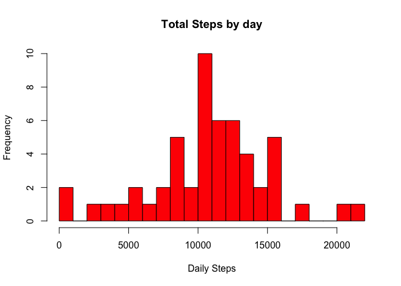
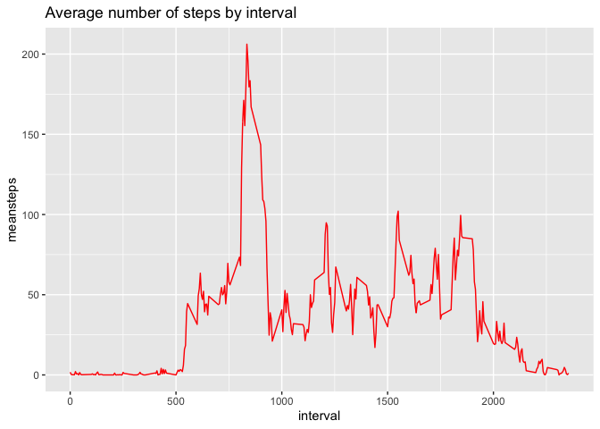
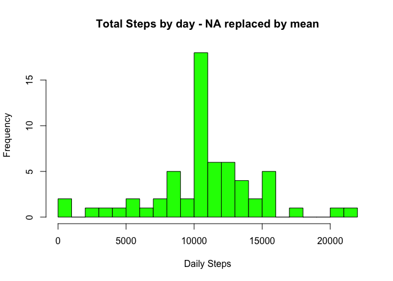
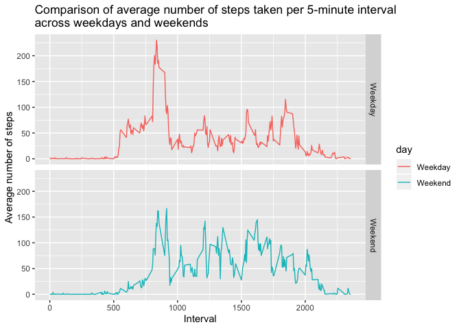

Author: SofieB  
Date: October 14, 2019

## Loading and preprocessing the data

Loading the data into the current working directory.


```r
download.file("https://d396qusza40orc.cloudfront.net/repdata%2Fdata%2Factivity.zip", destfile = "activity.zip", method="curl")
unzip(zipfile = "activity.zip")
activity <- read.csv(file = "activity.csv")
```

## What is mean total number of steps taken per day?

Calculate the total number of steps taken per day, ignoring the missing values.


```r
library(magrittr)
library(dplyr)
```

```
## 
## Attaching package: 'dplyr'
```

```
## The following objects are masked from 'package:stats':
## 
##     filter, lag
```

```
## The following objects are masked from 'package:base':
## 
##     intersect, setdiff, setequal, union
```

```r
TotalStepsDay <- activity %>% select(date, steps) %>% group_by(date) %>% summarize(totalsteps= sum(steps)) %>%na.omit()
```

Make a histogram of the total number of steps taken each day


```r
hist(TotalStepsDay$totalsteps, xlab = "Daily Steps",main="Total Steps by day", breaks = 20, col="red")
```

<!-- -->

## What is the average daily activity pattern?

Take the mean and median number of steps taken each day


```r
mean(TotalStepsDay$totalsteps)
```

```
## [1] 10766.19
```


```r
median(TotalStepsDay$totalsteps)
```

```
## [1] 10765
```

Show time series plot of the average number of steps taken


```r
library(ggplot2)  
StepsByInterval <- activity %>% select(interval, steps) %>% na.omit() %>% group_by(interval) %>% summarize(meansteps= mean(steps)) 
ggplot(StepsByInterval, aes(x=interval, y=meansteps))+ geom_line(color="red") + ggtitle("Average number of steps by interval")
```

<!-- -->

What is the 5-minute interval that, on average, contains the maximum number of steps


```r
MaxInterval <- StepsByInterval[which.max(StepsByInterval$meansteps),]
MaxInterval
```

```
## # A tibble: 1 x 2
##   interval meansteps
##      <int>     <dbl>
## 1      835      206.
```

## Imputing missing values

Code to describe and show a strategy for imputing missing data

Check how many of the data is missing


```r
missing <- is.na(activity$steps) 
table(missing)
```

```
## missing
## FALSE  TRUE 
## 15264  2304
```

13% of the observations are missing  
Strategy for imputing: replace NA's by the mean value of the interval in which the data is missing.  
Create a new dataset in which NA's are replaced.


```r
replaceNA <- function(x)
        {replace(x, is.na(x), mean(x, na.rm = TRUE))}
activityNoNA <- activity %>% group_by(interval) %>% mutate(steps= replaceNA(steps))
```

Histogram of the total number of steps taken each day after missing values are imputed


```r
TotalStepsDayNoNA <- activityNoNA %>% select(date, steps) %>% group_by(date) %>% summarize(totalsteps= sum(steps)) 
```

```
## Adding missing grouping variables: `interval`
```

```r
hist(TotalStepsDayNoNA$totalsteps, xlab = "Daily Steps",main="Total Steps by day - NA replaced by mean", breaks = 20, col="green")
```

<!-- -->

Re-calculate mean and median based on the new data.


```r
mean(TotalStepsDayNoNA$totalsteps)
```

```
## [1] 10766.19
```


```r
median(TotalStepsDayNoNA$totalsteps)
```

```
## [1] 10766.19
```

The mean stays identical, median is slightly higher, closer to the mean, which is logical.


## Are there differences in activity patterns between weekdays and weekends?

Convert dates, create extra factor variable "day' indicating if the date is weekday or weekend.


```r
activityNoNA$date <- as.Date(activityNoNA$date)
activityNoNA$day <- ifelse(weekdays(activityNoNA$date)=="Saturday"| weekdays(activityNoNA$date)=="Sunday", "Weekend", "Weekday")
activityNoNA$day <- as.factor(activityNoNA$day)
```

Panel plot comparing the average number of steps taken per 5-minute interval across weekdays and weekends


```r
library(ggplot2)
StepsByIntervalDay <- activityNoNA %>% select(interval, steps, day) %>% group_by(interval, day) %>% summarize(meansteps= mean(steps))
ggplot(StepsByIntervalDay, aes(x=interval, y=meansteps, color=day)) + geom_line() + facet_grid(day~.) + xlab("Interval") + ylab("Average number of steps") + ggtitle("Comparison of average number of steps taken per 5-minute interval \nacross weekdays and weekends")
```

<!-- -->

